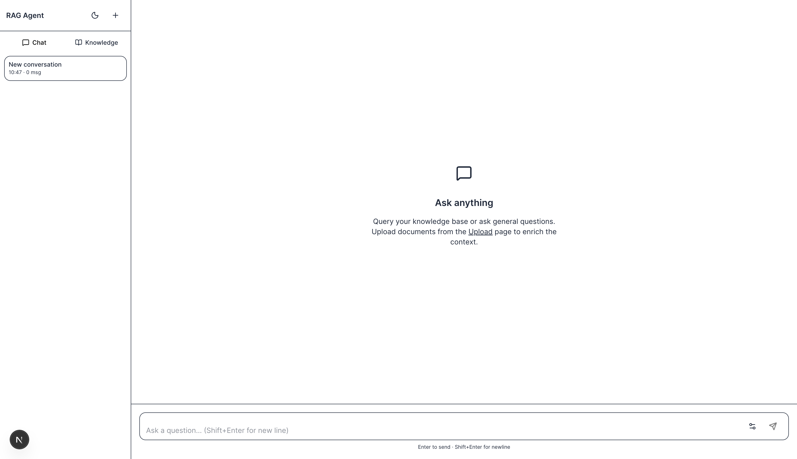

# RAG Agent System



## Tech Stack

### Backend

| Layer            | Technology                                 |
| ---------------- | ------------------------------------------ |
| Runtime          | Java 21 (virtual threads)                  |
| Framework        | Spring Boot 3.5                            |
| AI orchestration | Spring AI 1.1                              |
| Agent graph      | LangGraph4j 1.7                            |
| LLM providers    | OpenAI / OpenRouter, Anthropic Claude      |
| Vector store     | Weaviate                                   |
| Embeddings       | Spring AI embedding abstraction            |
| Document parsing | Apache Tika (PDF, text, HTML)              |
| HTML scraping    | Jsoup                                      |
| Circuit breaker  | Resilience4j 2.2                           |
| Auth             | OTP email (Resend) + JJWT stateless tokens |
| Persistence      | MySQL 8 + Spring Data JPA                  |
| MCP server       | Spring AI MCP WebMVC SSE transport         |
| API docs         | SpringDoc OpenAPI (Swagger UI)             |

### Frontend

| Layer     | Technology              |
| --------- | ----------------------- |
| Framework | Next.js 16 (App Router) |
| Language  | TypeScript 6            |
| UI        | React 19                |
| State     | Zustand 5               |
| Styling   | Tailwind CSS 4          |

### Infrastructure

| Component        | Technology        |
| ---------------- | ----------------- |
| Vector DB        | Weaviate (Docker) |
| Relational DB    | MySQL (Docker)    |
| Containerization | Docker Compose    |

---

## System Architecture

```
┌─────────────────────────────────────────────────────────────┐
│                        Frontend (Next.js)                   │
│   /          Chat UI                                        │
│   /upload    Document & URL ingestion                       │
│   /knowledge Knowledge base browser                        │
│   /mcp       MCP tool explorer                              │
│   /api       API proxy routes                               │
└──────────────────────────┬──────────────────────────────────┘
                           │ HTTP / SSE (streaming)
┌──────────────────────────▼──────────────────────────────────┐
│                   Spring Boot Backend                        │
│                                                             │
│  AuthFilter (JWT)  ──►  AgentController                    │
│                               │                             │
│                    ┌──────────▼──────────┐                  │
│                    │   RagAgentGraph      │                  │
│                    │  (LangGraph4j)       │                  │
│                    │                     │                  │
│                    │  START              │                  │
│                    │    └─► analyzeQuery │                  │
│                    │          ├─[RETRIEVE]─► retrieve       │
│                    │          │               ├─[found]──►  │
│                    │          │               └─[empty]──►  │
│                    │          ├─[DIRECT]──► generate ──►END │
│                    │          └─[FALLBACK]─► fallback ──►END│
│                    └─────────────────────┘                  │
│                                                             │
│  ┌──────────────────┐   ┌──────────────┐  ┌─────────────┐  │
│  │ DocumentIngestion│   │  Retrieval   │  │  Fallback   │  │
│  │ Service (Tika +  │   │  Service     │  │  Service    │  │
│  │  Jsoup)          │   │  (Weaviate)  │  │ (Resilience4j)│ │
│  └────────┬─────────┘   └──────┬───────┘  └─────────────┘  │
│           │                    │                             │
│  ┌────────▼────────────────────▼──────┐                     │
│  │        Spring AI Abstraction        │                     │
│  │  EmbeddingModel  │  ChatModel       │                     │
│  └──────┬──────────────────┬──────────┘                     │
│         │                  │                                 │
│   ┌─────▼────┐      ┌──────▼──────┐                         │
│   │ Weaviate │      │ OpenAI /    │                         │
│   │ Vector   │      │ Anthropic   │                         │
│   │ Store    │      │ Claude      │                         │
│   └──────────┘      └─────────────┘                         │
│                                                             │
│  ┌─────────────────────┐  ┌──────────────────────────────┐  │
│  │  Auth Module        │  │  MCP Server (SSE)            │  │
│  │  OtpCode (MySQL)    │  │  Exposes RAG tools to        │  │
│  │  EmailWhitelist     │  │  external MCP clients        │  │
│  │  JWT tokens         │  │  (e.g. Claude Desktop)       │  │
│  └─────────────────────┘  └──────────────────────────────┘  │
└─────────────────────────────────────────────────────────────┘
                           │
             ┌─────────────┴──────────┐
             │                        │
      ┌──────▼──────┐         ┌───────▼──────┐
      │  Weaviate   │         │    MySQL      │
      │  (vectors)  │         │  (auth data,  │
      │             │         │  conversations│
      └─────────────┘         └──────────────┘
```

### Agent Graph Routing

The LangGraph4j graph determines the execution path per query:

| Route                | Condition                          | Path                                        |
| -------------------- | ---------------------------------- | ------------------------------------------- |
| `RETRIEVE`         | Query needs knowledge base context | analyzeQuery → retrieve → generate → END |
| `RETRIEVE` (empty) | No matching documents found        | analyzeQuery → retrieve → fallback → END |
| `DIRECT`           | Query answerable without retrieval | analyzeQuery → generate → END             |
| `FALLBACK`         | Query out of scope / unsafe        | analyzeQuery → fallback → END             |

### Auth Flow

1. User submits email → backend checks whitelist → sends OTP via Resend
2. User submits OTP → backend validates → issues signed JWT
3. All subsequent API calls carry the JWT; `AuthFilter` validates on every request
