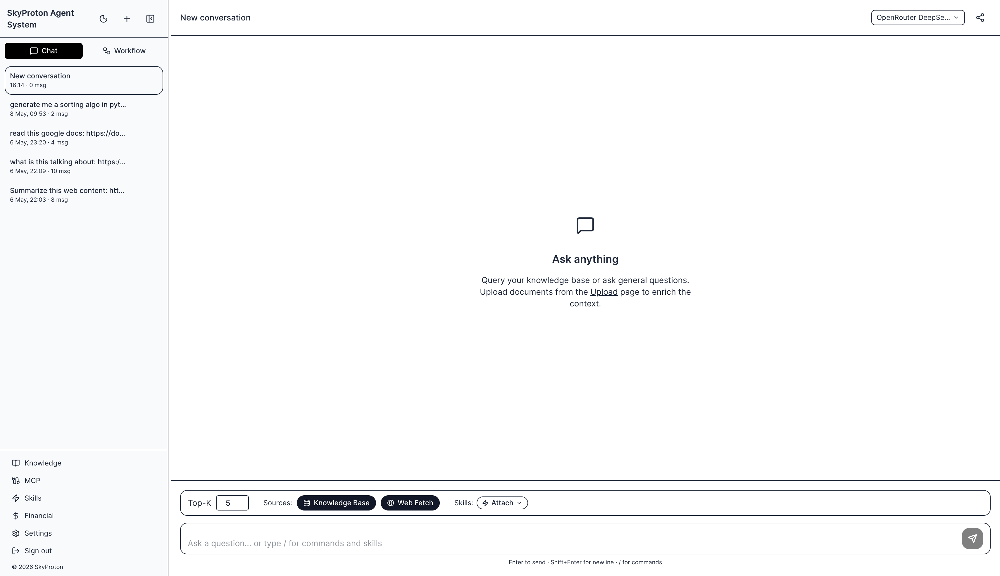
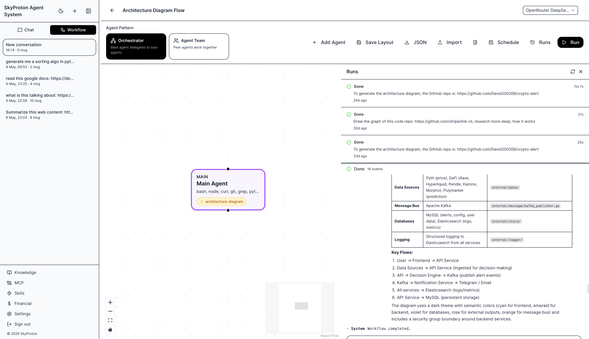

# SkyProton Agent System

| Chat Mode                | Workflow Mode                    |
| ------------------------ | -------------------------------- |
|  |  |

## Tech Stack

### Agent CLI

| Layer    | Technology                                                         |
| -------- | ------------------------------------------------------------------ |
| Runtime  | Go 1.22                                                            |
| CLI      | Cobra                                                              |
| Auth     | OTP email + JWT (stored in `~/.agent-cli/config.json`)             |
| Identity | Ed25519 key pair — CLI signs requests after login                  |
| Release  | GitHub Actions cross-compile (linux/darwin/windows × amd64/arm64) |

### Backend

| Layer            | Technology                                         |
| ---------------- | -------------------------------------------------- |
| Runtime          | Java 21 (virtual threads)                          |
| Framework        | Spring Boot 3.4.5                                  |
| AI orchestration | Spring AI 1.1                                      |
| Agent graph      | LangGraph4j 1.7                                    |
| LLM providers    | OpenAI / OpenRouter / Anthropic / DeepSeek / Local |
| Vector store     | Weaviate                                           |
| Embeddings       | Spring AI embedding abstraction                    |
| Document parsing | Apache Tika (PDF, text, HTML)                      |
| HTML scraping    | Jsoup                                              |
| Circuit breaker  | Resilience4j 2.2                                   |
| Auth             | OTP email (Resend) + Passkey (WebAuthn) + JJWT     |
| Persistence      | MySQL 8 + Spring Data JPA                          |
| Redis            | Lettuce (Bucket4j rate limits, fallback cache) + Redisson (sandbox semaphore) — shared with the scheduler's Asynq queue |
| MCP server       | Spring AI MCP WebMVC SSE transport                 |
| API docs         | SpringDoc OpenAPI (Swagger UI)                     |

### Scheduler

| Layer            | Technology                             |
| ---------------- | -------------------------------------- |
| Runtime          | Go 1.24                                |
| Task queue       | Asynq (Redis-backed)                   |
| Schedule storage | MySQL (shared with app DB)             |
| Retry policy     | MaxRetry=3, task timeout=5 min (Asynq) |

### Frontend

| Layer     | Technology              |
| --------- | ----------------------- |
| Framework | Next.js 16 (App Router) |
| Language  | TypeScript 6            |
| UI        | React 19                |
| State     | Zustand 5               |
| Styling   | Tailwind CSS 4          |

### Infrastructure

| Component        | Technology                                    |
| ---------------- | --------------------------------------------- |
| Vector DB        | Weaviate (Docker)                             |
| Relational DB    | MySQL (Docker) — app + schedule data         |
| Redis            | Redis 7 (Docker) — shared by the scheduler's Asynq queue and the backend's rate limits, sandbox tracking, and fallback cache |
| Scheduler        | Go microservice backed by Asynq (`:8082`)    |
| Observability    | Prometheus + Grafana + Loki + Promtail        |
| Containerization | Docker Compose                                |

---

## System Architecture

```
  ┌──────────────────────────┐   ┌──────────────────────────┐
  │     Frontend (Next.js)   │   │     agent-cli (Go)        │
  │  /  /upload  /workflow…  │   │  auth / chat / workflow   │
  │  /settings  /team  /mcp  │   │  conversation / financial │
  └────────────┬─────────────┘   └────────────┬──────────────┘
               │ HTTP / SSE                   │ HTTP + JWT
               └──────────────┬───────────────┘
┌──────────────▼───────────────────────────────────────────────┐
│                   Spring Boot Backend (:8081)                 │
│                                                               │
│  AuthFilter (JWT: email + mode + orgId)                       │
│       │                                                       │
│       ├──► AgentController  ──► RagAgentGraph (LangGraph4j)  │
│       │         │                    │                        │
│       │         │          ┌─────────▼──────────┐            │
│       │         │          │  analyzeQuery       │            │
│       │         │          │  ├─[RETRIEVE]──►    │            │
│       │         │          │  │   retrieve        │            │
│       │         │          │  │   ├─[found]──► generate      │
│       │         │          │  │   └─[empty]──► fallback      │
│       │         │          │  ├─[DIRECT]──► generate         │
│       │         │          │  └─[FALLBACK]──► fallback       │
│       │         │          └─────────────────────┘           │
│       │         │                                             │
│       ├──► ConversationService  (org-scoped)                  │
│       ├──► OrganizationController / TeamController            │
│       ├──► ConnectorController  (org-scoped OAuth tokens)     │
│       ├──► WorkflowController                                 │
│       └──► AuthController  (OTP + Passkey / WebAuthn)        │
│                                                               │
│  ┌──────────────┐  ┌──────────────┐  ┌────────────────────┐  │
│  │ Auth Module  │  │  MCP Server  │  │  Workflow Engine   │  │
│  │ OTP + Passkey│  │  (SSE)       │  │  + Sandbox +       │  │
│  │ PERSONAL /   │  │              │  │  SCHEDULE tool     │  │
│  │ TEAM JWT     │  └──────────────┘  └────────────────────┘  │
│  └──────────────┘                                             │
│  ┌──────────────────────────────────────────────────────────┐ │
│  │  Connectors (org-scoped tokens)                          │ │
│  │  Google Docs · Sheets · Slides · Calendar · Telegram     │ │
│  └──────────────────────────────────────────────────────────┘ │
│  ┌──────────────┐  ┌──────────────┐                           │
│  │  Team / Org  │  │    Model     │                           │
│  │  management  │  │  Selection   │                           │
│  │  (OWNER /    │  │  (per-user   │                           │
│  │   MEMBER)    │  │   + per-conv)│                           │
│  └──────────────┘  └──────────────┘                           │
└──────────────────────────────────────────────────────────────┘
          │                    │                   │
  ┌───────▼──────┐   ┌────────▼────────┐  ┌───────▼─────────────────┐
  │  Weaviate    │   │     MySQL       │  │  Go Scheduler (:8082)   │
  │  (vectors)   │   │  (auth, convos, │  │                         │
  │              │   │   workflows,    │  │  Asynq Scheduler        │
  └──────────────┘   │   skills,       │  │    └─ enqueues tasks    │
                     │   schedules,    │  │  Asynq Worker           │
                     │   model_configs,│  │    └─ rag:trigger       │
                     │   orgs/members, │  │         (MaxRetry=3)    │
                     │   connectors)   │  │                         │
                     └─────────────────┘  └─────────────────────────┘
```

---

## Authentication

The system supports two login methods, both producing a signed JWT that encodes `email`, `mode` (`PERSONAL` / `TEAM`), and `orgId` (team mode only).

### Email OTP

A 6-digit one-time code is sent via Resend to the user's whitelisted email address.

### Passkey (WebAuthn)

Users can register a passkey (Face ID, Touch ID, or hardware key) from the Settings page. On subsequent logins, the passkey challenge/response flow issues a JWT scoped to the correct mode and org — including team mode passkey logins.

---

## Personal vs Team Mode

Each JWT is scoped to a mode. The backend enforces isolation at every data layer.

| Resource             | Personal mode     | Team mode                        |
| -------------------- | ----------------- | -------------------------------- |
| Conversations        | Per-user          | Per-user, scoped to org          |
| Knowledge base       | Per-user          | Shared across org                |
| Workflows            | Per-user          | Shared across org                |
| Skills               | Per-user          | Shared across org                |
| Web-fetch whitelist  | Per-user          | Shared across org                |
| Connector tokens     | Per-user          | Per-user, scoped to org          |
| Financial portfolio  | Per-user          | Hidden in team mode              |

### Organizations

Organizations are pre-created by an admin (`POST /api/v1/admin/organizations`). Members are added by an owner via the in-app Team page or the `POST /api/v1/team/members` API.

**Team member management** (`/team` page — visible only in team mode):

| Action               | Who can perform |
| -------------------- | --------------- |
| View member list     | All members     |
| Add / remove member  | Owner only      |
| Transfer ownership   | Owner only      |

---

## Agent Graph Routing

The LangGraph4j graph determines the execution path per query:

| Route                | Condition                          | Path                                        |
| -------------------- | ---------------------------------- | ------------------------------------------- |
| `RETRIEVE`         | Query needs knowledge base context | analyzeQuery → retrieve → generate → END |
| `RETRIEVE` (empty) | No matching documents found        | analyzeQuery → retrieve → fallback → END |
| `DIRECT`           | Query answerable without retrieval | analyzeQuery → generate → END             |
| `FALLBACK`         | Query out of scope / unsafe        | analyzeQuery → fallback → END             |

---

## Connectors (MCP)

External services are connected via OAuth (Google, Figma) or the Telegram Login Widget. Connector tokens are **org-scoped**: connecting Google in personal mode and in team mode produces two separate, isolated tokens.

| Connector        | Provider key | Features                                              |
| ---------------- | ------------ | ----------------------------------------------------- |
| Google Docs      | `google`     | Read documents, write new docs                        |
| Google Sheets    | `google`     | Read spreadsheets, write new sheets                   |
| Google Slides    | `google`     | Read presentations, write new slides                  |
| Google Calendar  | `google`     | List upcoming events, create new events               |
| Figma            | `figma`      | OAuth token for Figma file access                     |
| Telegram         | `telegram`   | Send messages to the user's linked Telegram chat      |

All four Google services share a single OAuth token (one `provider="google"` entry per user per org). The OAuth consent includes the Calendar scope alongside Docs/Sheets/Slides/Drive.

### Agent tools

When Google or Telegram is connected, the following tools are available inside the chat agent:

| Tool                    | Trigger examples                                              |
| ----------------------- | ------------------------------------------------------------- |
| `readGoogleDoc`         | User pastes a `docs.google.com/document` URL                 |
| `readGoogleSheet`       | User pastes a `docs.google.com/spreadsheets` URL             |
| `readGoogleSlide`       | User pastes a `docs.google.com/presentation` URL             |
| `writeToGoogleDocs`     | "Save this to Google Docs", "Export as a document"           |
| `writeToGoogleSheets`   | "Save this table to Sheets", "Export as a spreadsheet"       |
| `writeToGoogleSlides`   | "Create a presentation from this", "Make slides"             |
| `listUpcomingEvents`    | "What's on my calendar?", "What do I have this week?"        |
| `createCalendarEvent`   | "Schedule a meeting", "Add to my calendar"                   |
| `sendTelegramMessage`   | "Send this to my Telegram", "Notify me via Telegram"         |
| `createTelegramGroupSession` | "Notify both of us on Telegram" (shared conversations) |

---

## Workflow Engine

Workflows compose multiple AI agents into pipelines with two patterns:

| Pattern          | Description                                                 |
| ---------------- | ----------------------------------------------------------- |
| `ORCHESTRATOR` | One orchestrator agent routes tasks to specialist agents    |
| `TEAM`         | Multiple agents run in `PARALLEL` or `SEQUENTIAL` order |

Each workflow run executes inside an ephemeral Docker sandbox (`SandboxService`) with CPU/memory resource limits and a watchdog that terminates runaway containers. Agents can load user-uploaded **Skills** (code files) to extend their capabilities.

### Available Tools

| Tool              | Description                                                        |
| ----------------- | ------------------------------------------------------------------ |
| `BASH`          | Execute shell commands in the sandbox                              |
| `CURL`          | HTTP requests from the sandbox                                     |
| `GIT`           | Git operations in the sandbox                                      |
| `GREP`          | Text search in the sandbox                                         |
| `PYTHON`        | Run Python scripts in the sandbox                                  |
| `NODE`          | Run Node.js scripts in the sandbox                                 |
| `SCHEDULE`      | Create, list, or delete scheduled RAG queries (calls Go scheduler) |
| `GOOGLE_DOCS`   | Read and write Google Docs via connected OAuth token               |
| `GOOGLE_SHEETS` | Read and write Google Sheets via connected OAuth token             |
| `GOOGLE_SLIDES` | Read and write Google Slides via connected OAuth token             |
| `GOOGLE_CALENDAR` | List and create Google Calendar events                           |
| `TELEGRAM`      | Send messages to a connected Telegram chat                         |

The `SCHEDULE` tool lets a workflow agent manage schedules on behalf of the user:

```xml
<!-- Create a scheduled query -->
<use_tool name="SCHEDULE">
{"action":"create","conversationId":"<id>","message":"Daily market summary","cron":"0 9 * * 1-5","timezone":"America/New_York","topK":5,"useKnowledgeBase":true,"useWebFetch":true}
</use_tool>

<!-- List existing schedules -->
<use_tool name="SCHEDULE">
{"action":"list","conversationId":"<id>"}
</use_tool>

<!-- Delete a schedule -->
<use_tool name="SCHEDULE">
{"action":"delete","scheduleId":"<schedule-id>"}
</use_tool>
```

---

## Conversation Sharing

Conversations can be shared via a link with configurable access controls.

| Field          | Values                          | Description                                   |
| -------------- | ------------------------------- | --------------------------------------------- |
| `shareMode`  | `READ_ONLY` / `INTERACTIVE` | Viewer can read only, or also send messages   |
| `accessType` | `EVERYONE` / `WHITELIST`    | Public link or restricted to specified emails |

When `accessType` is `WHITELIST`, only listed emails may access the shared link. `INTERACTIVE` shares notify the conversation owner via Telegram (if connected) when a new participant joins.

---

## Agent CLI

A standalone Go binary that wraps the backend REST API for terminal use. Config is stored in `~/.agent-cli/config.json`. On first login an Ed25519 key pair is generated and the public key is registered with the server.

### Install

**macOS (Apple Silicon)**
```bash
curl -L https://github.com/David200308/rag-agent-system/releases/latest/download/agent-cli_darwin_arm64 \
  -o agent-cli && chmod +x agent-cli && sudo mv agent-cli /usr/local/bin/
```

**macOS (Intel)**
```bash
curl -L https://github.com/David200308/rag-agent-system/releases/latest/download/agent-cli_darwin_amd64 \
  -o agent-cli && chmod +x agent-cli && sudo mv agent-cli /usr/local/bin/
```

**Linux (amd64)**
```bash
curl -L https://github.com/David200308/rag-agent-system/releases/latest/download/agent-cli_linux_amd64 \
  -o agent-cli && chmod +x agent-cli && sudo mv agent-cli /usr/local/bin/
```

**Windows** — download `agent-cli_windows_amd64.exe` from the [Releases](https://github.com/David200308/rag-agent-system/releases) page.

### First-time setup

```bash
agent-cli auth config --url https://api.agent.skyproton.com
agent-cli auth login
```

### Commands

| Command | Subcommands | Description |
| ------- | ----------- | ----------- |
| `auth` | `login` `logout` `status` `config` | Authenticate via email OTP; manage server URL |
| `chat` | *(interactive REPL)* `ask <question>` | Chat with the RAG agent; `-c <id>` continues a conversation |
| `conversation` (alias `conv`) | `list` `get` `delete` `archive` `unarchive` | Manage conversations |
| `workflow` (alias `wf`) | `list` `get` `delete` `runs` `logs` | View workflows, run history, and agent logs |
| `financial` (alias `fin`) | `deposits` `stocks` `crypto` `cards` `prices` | Manage financial portfolio entries |

#### Examples

```bash
# Interactive chat session
agent-cli chat

# Single-shot query, continuing an existing conversation
agent-cli chat ask "Summarise the last earnings call" -c <conversation-id>

# List recent conversations
agent-cli conversation list

# View logs for a workflow run
agent-cli workflow logs <run-id>

# Add a stock position
agent-cli financial stocks add --data '{"symbol":"AAPL","stockAmount":10,"investAmount":1500,"currency":"USD"}'

# Force-refresh live market prices
agent-cli financial prices refresh
```

---

## Scheduler

The Go microservice (`:8082`) uses **Asynq** (Redis-backed) for durable cron scheduling, with schedule state persisted in MySQL.

### How it works

```
Frontend / Workflow Agent
        │
        │  REST (JWT or service-key)
        ▼
Go Scheduler (:8082)
  ├── REST API  →  cronmgr (asynq.Scheduler)  →  Redis
  └── Asynq Worker (same process)
           └── rag:trigger handler
                 └── POST Spring Boot /api/v1/scheduler/trigger
                           (MaxRetry=3, Timeout=5 min)
```

On startup the scheduler reloads all active schedules from MySQL into the Asynq in-process cron engine. When a cron fires, Asynq enqueues a `rag:trigger` task to Redis. The worker picks it up and POSTs to Spring Boot. If the call fails, Asynq retries up to 3 times automatically. Each run is recorded in `schedule_runs` (MySQL).
