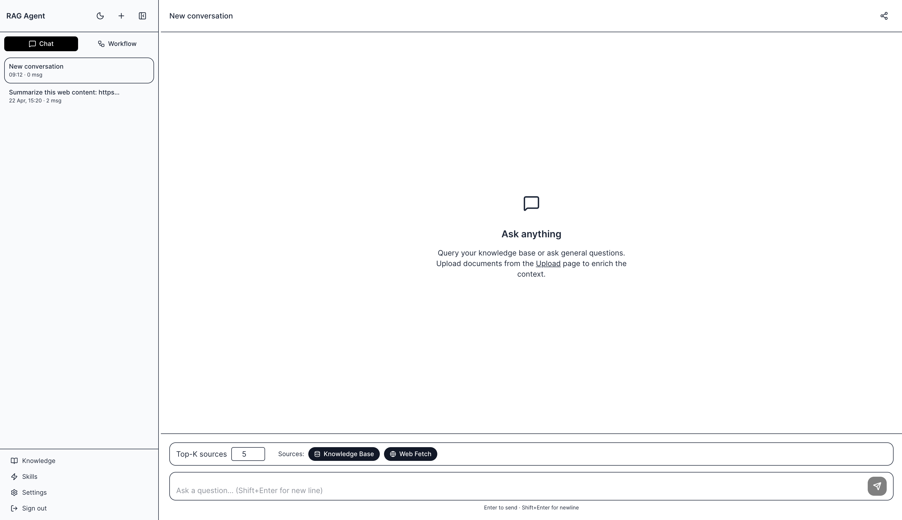

# RAG Agent System



## Tech Stack

### Backend

| Layer            | Technology                                 |
| ---------------- | ------------------------------------------ |
| Runtime          | Java 21 (virtual threads)                  |
| Framework        | Spring Boot 3.4.5                          |
| AI orchestration | Spring AI 1.1                              |
| Agent graph      | LangGraph4j 1.7                            |
| LLM providers    | OpenAI / OpenRouter / Anthropic / Local    |
| Vector store     | Weaviate                                   |
| Embeddings       | Spring AI embedding abstraction            |
| Document parsing | Apache Tika (PDF, text, HTML)              |
| HTML scraping    | Jsoup                                      |
| Circuit breaker  | Resilience4j 2.2                           |
| Auth             | OTP email (Resend) + JJWT stateless tokens |
| Persistence      | MySQL 8 + Spring Data JPA                  |
| MCP server       | Spring AI MCP WebMVC SSE transport         |
| API docs         | SpringDoc OpenAPI (Swagger UI)             |

### Scheduler

| Layer            | Technology                                           |
| ---------------- | ---------------------------------------------------- |
| Runtime          | Go 1.24                                              |
| Workflow engine  | Temporal SDK v1.44 (self-hosted)                     |
| Schedule storage | Temporal Server + PostgreSQL (separate from app DB)  |
| Retry policy     | 3 attempts, 2s → 4s → 8s exponential backoff         |
| Observability    | Temporal Web UI (`:8088`)                            |

### Frontend

| Layer     | Technology              |
| --------- | ----------------------- |
| Framework | Next.js 16 (App Router) |
| Language  | TypeScript 6            |
| UI        | React 19                |
| State     | Zustand 5               |
| Styling   | Tailwind CSS 4          |

### Infrastructure

| Component        | Technology                                       |
| ---------------- | ------------------------------------------------ |
| Vector DB        | Weaviate (Docker)                                |
| Relational DB    | MySQL (Docker) — app data                        |
| Workflow DB      | PostgreSQL (Docker) — Temporal state only        |
| Scheduler        | Go microservice backed by Temporal (`:8082`)     |
| Scheduler UI     | Temporal Web UI (`:8088`)                        |
| Containerization | Docker Compose                                   |

---

## System Architecture

```
  ┌──────────────────────────┐
  │     Frontend (Next.js)   │
  │  /  /upload  /workflow…  │
  └────────────┬─────────────┘
               │ HTTP / SSE
               │
┌──────────────▼───────────────────────────────────────────────┐
│                   Spring Boot Backend (:8081)                 │
│                                                              │
│  AuthFilter (JWT)  ──►  AgentController                     │
│                               │                             │
│                    ┌──────────▼──────────┐                  │
│                    │   RagAgentGraph      │                  │
│                    │  (LangGraph4j)       │                  │
│                    │                     │                  │
│                    │  START              │                  │
│                    │    └─► analyzeQuery │                  │
│                    │          ├─[RETRIEVE]─► retrieve       │
│                    │          │               ├─[found]──►  │
│                    │          │               └─[empty]──►  │
│                    │          ├─[DIRECT]──► generate ──►END │
│                    │          └─[FALLBACK]─► fallback ──►END│
│                    └─────────────────────┘                  │
│                                                             │
│  ┌──────────────────┐   ┌──────────────┐  ┌─────────────┐  │
│  │ DocumentIngestion│   │  Retrieval   │  │  Fallback   │  │
│  │ Service (Tika +  │   │  Service     │  │  Service    │  │
│  │  Jsoup)          │   │  (Weaviate)  │  │ (Resilience4j)│ │
│  └────────┬─────────┘   └──────┬───────┘  └─────────────┘  │
│           │                    │                             │
│  ┌────────▼────────────────────▼──────┐                     │
│  │        Spring AI Abstraction        │                     │
│  │  EmbeddingModel  │  ChatModel       │                     │
│  └──────┬──────────────────┬──────────┘                     │
│         │                  │                                 │
│   ┌─────▼────┐      ┌──────▼──────┐                         │
│   │ Weaviate │      │ OpenAI /    │                         │
│   │ Vector   │      │ Anthropic / │                         │
│   │ Store    │      │ OpenRouter  │                         │
│   └──────────┘      └─────────────┘                         │
│                                                             │
│  ┌──────────────┐  ┌──────────────┐  ┌────────────────────┐ │
│  │ Auth Module  │  │  MCP Server  │  │  Workflow Engine   │ │
│  │ OTP + JWT    │  │  (SSE)       │  │  + Sandbox +       │ │
│  └──────────────┘  └──────────────┘  │  SCHEDULE tool     │ │
│                                      └────────────────────┘ │
└─────────────────────────────────────────────────────────────┘
          │                    │                   │
  ┌───────▼──────┐   ┌────────▼────────┐  ┌───────▼─────────────────┐
  │  Weaviate    │   │     MySQL       │  │  Go Scheduler (:8082)   │
  │  (vectors)   │   │  (auth, convos, │  │                         │
  │              │   │   workflows,    │  │  Temporal Worker        │
  └──────────────┘   │   skills)       │  │    └─ RagQueryWorkflow  │
                     └─────────────────┘  │    └─ TriggerActivity   │
                                          │         (3× retry)      │
                                          │                         │
                                          │  ┌─────────────────┐    │
                                          │  │ Temporal Server │    │
                                          │  │  (:7233)        │    │
                                          │  │  + PostgreSQL   │    │
                                          │  └─────────────────┘    │
                                          └─────────────────────────┘
```

---

## Agent Graph Routing

The LangGraph4j graph determines the execution path per query:

| Route              | Condition                          | Path                                        |
| ------------------ | ---------------------------------- | ------------------------------------------- |
| `RETRIEVE`         | Query needs knowledge base context | analyzeQuery → retrieve → generate → END    |
| `RETRIEVE` (empty) | No matching documents found        | analyzeQuery → retrieve → fallback → END    |
| `DIRECT`           | Query answerable without retrieval | analyzeQuery → generate → END              |
| `FALLBACK`         | Query out of scope / unsafe        | analyzeQuery → fallback → END              |

---

## Workflow Engine

Workflows compose multiple AI agents into pipelines with two patterns:

| Pattern        | Description                                               |
| -------------- | --------------------------------------------------------- |
| `ORCHESTRATOR` | One orchestrator agent routes tasks to specialist agents  |
| `TEAM`         | Multiple agents run in `PARALLEL` or `SEQUENTIAL` order  |

Each workflow run executes inside an ephemeral Docker sandbox (`SandboxService`) with CPU/memory resource limits and a watchdog that terminates runaway containers. Agents can load user-uploaded **Skills** (code files) to extend their capabilities.

### Available Tools

| Tool              | Description                                                        |
| ----------------- | ------------------------------------------------------------------ |
| `BASH`            | Execute shell commands in the sandbox                              |
| `CURL`            | HTTP requests from the sandbox                                     |
| `GIT`             | Git operations in the sandbox                                      |
| `GREP`            | Text search in the sandbox                                         |
| `PYTHON`          | Run Python scripts in the sandbox                                  |
| `NODE`            | Run Node.js scripts in the sandbox                                 |
| `SCHEDULE`        | Create, list, or delete scheduled RAG queries (calls Go scheduler) |

The `SCHEDULE` tool lets a workflow agent manage schedules on behalf of the user:

```xml
<!-- Create a scheduled query -->
<use_tool name="SCHEDULE">
{"action":"create","conversationId":"<id>","message":"Daily market summary","cron":"0 9 * * 1-5","timezone":"America/New_York","topK":5,"useKnowledgeBase":true,"useWebFetch":true}
</use_tool>

<!-- List existing schedules -->
<use_tool name="SCHEDULE">
{"action":"list","conversationId":"<id>"}
</use_tool>

<!-- Delete a schedule -->
<use_tool name="SCHEDULE">
{"action":"delete","scheduleId":"<schedule-id>"}
</use_tool>
```

---

## Scheduler

The Go microservice (`:8082`) uses **Temporal** as its workflow engine for durable, observable cron scheduling.

### How it works

```
Frontend / Workflow Agent
        │
        │  REST (JWT or service-key)
        ▼
Go Scheduler (:8082)
  ├── REST API  →  Temporal Schedule Client  →  Temporal Server (:7233)
  └── Temporal Worker (same process)
           └── RagQueryWorkflow
                 └── TriggerActivity ──► Spring Boot /api/v1/scheduler/trigger
```

When a cron fires, Temporal starts a `RagQueryWorkflow` on the worker. The workflow calls `TriggerActivity` which POSTs to Spring Boot. If Spring Boot is down, Temporal retries automatically (3×, exponential backoff). Every execution is recorded in Temporal's database.

### Scheduler API

| Method   | Path                          | Auth        | Description                                |
| -------- | ----------------------------- | ----------- | ------------------------------------------ |
| `GET`    | `/schedules?conversationId=`  | JWT         | List schedules for a conversation          |
| `POST`   | `/schedules`                  | JWT         | Create a new schedule                      |
| `PATCH`  | `/schedules/{id}`             | JWT         | Update schedule (cron, message, enabled…)  |
| `DELETE` | `/schedules/{id}`             | JWT         | Delete a schedule                          |
| `GET`    | `/schedules/{id}/runs`        | JWT         | List recent execution history              |
| `POST`   | `/internal/schedules`         | Service key | Create on behalf of a workflow agent       |
| `GET`    | `/internal/schedules`         | Service key | List on behalf of a workflow agent         |
| `DELETE` | `/internal/schedules/{id}`    | Service key | Delete on behalf of a workflow agent       |

### Schedule fields

| Field              | Description                                          |
| ------------------ | ---------------------------------------------------- |
| `id`               | UUID string (Temporal Schedule ID)                   |
| `cronExpr`         | 5-field cron expression (e.g. `0 9 * * 1-5`)        |
| `timezone`         | IANA timezone name (e.g. `America/New_York`)         |
| `message`          | Query sent to the RAG pipeline on each tick          |
| `enabled`          | Pause/resume without deleting                        |
| `nextRunAt`        | Next scheduled fire time (computed by Temporal)      |
| `lastRunAt`        | Most recent actual execution time                    |

### Temporal Web UI

The Temporal UI is available at **http://localhost:8088** when running with Docker Compose. It shows all schedules, individual workflow run history, retry attempts, and error details — no extra tooling needed.

---

## Auth Flow

**End-user (JWT):**

1. User submits email → backend checks whitelist → sends OTP via Resend
2. User submits OTP → backend validates → issues signed JWT
3. All subsequent API calls carry the JWT; `AuthFilter` validates on every request

**Service-to-service:**

- Go scheduler → Spring Boot: `X-Scheduler-Key` shared secret header
- Spring Boot → Go scheduler (workflow tool): same `X-Scheduler-Key`

---

## Running locally

```bash
# Copy and configure environment variables
cp .env.example .env

# Start all services
docker compose up --build

# Services
# Frontend:      http://localhost:3000
# Backend API:   http://localhost:8081/swagger-ui.html
# Scheduler:     http://localhost:8082/health
# Temporal UI:   http://localhost:8088
# Weaviate:      http://localhost:8080
```

> **First run:** Temporal auto-setup takes ~60 seconds to initialise its PostgreSQL schema. The scheduler container will wait for it automatically.
