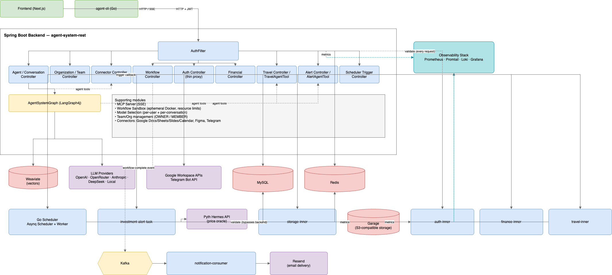

# SkyProton Agent System

| Chat Mode                  | Workflow Mode                      |
| -------------------------- | ---------------------------------- |
|  |  |

## Tech Stack

### Agent CLI

| Layer    | Technology                                                         |
| -------- | ------------------------------------------------------------------ |
| Runtime  | Go 1.22                                                            |
| CLI      | Cobra                                                              |
| Auth     | OTP email + JWT (stored in`~/.agent-cli/config.json`)            |
| Identity | Ed25519 key pair — CLI signs requests after login                 |
| Release  | GitHub Actions cross-compile (linux/darwin/windows × amd64/arm64) |

### Backend

| Layer            | Technology                                                                                                               |
| ---------------- | ------------------------------------------------------------------------------------------------------------------------ |
| Runtime          | Java 21 (virtual threads)                                                                                                |
| Framework        | Spring Boot 3.4.5                                                                                                        |
| AI orchestration | Spring AI 1.1                                                                                                            |
| Agent graph      | LangGraph4j 1.7                                                                                                          |
| LLM providers    | OpenAI / OpenRouter / Anthropic / DeepSeek / Local                                                                       |
| Vector store     | Weaviate                                                                                                                 |
| Embeddings       | Spring AI embedding abstraction                                                                                          |
| Document parsing | Apache Tika (PDF, text, HTML)                                                                                            |
| HTML scraping    | Jsoup                                                                                                                    |
| Circuit breaker  | Resilience4j 2.2                                                                                                         |
| Auth             | OTP email (Resend) + Passkey (WebAuthn) + JJWT                                                                           |
| Persistence      | MySQL 8 + Spring Data JPA                                                                                                |
| Redis            | Lettuce (Bucket4j rate limits, fallback cache) + Redisson (sandbox semaphore) — shared with the scheduler's Asynq queue |
| MCP server       | Spring AI MCP WebMVC SSE transport                                                                                       |
| API docs         | SpringDoc OpenAPI (Swagger UI)                                                                                           |

### Scheduler

| Layer            | Technology                             |
| ---------------- | -------------------------------------- |
| Runtime          | Go 1.25                                |
| Task queue       | Asynq (Redis-backed)                   |
| Schedule storage | MySQL (shared with app DB)             |
| Retry policy     | MaxRetry=3, task timeout=5 min (Asynq) |

### Frontend

| Layer     | Technology              |
| --------- | ----------------------- |
| Framework | Next.js 16 (App Router) |
| Language  | TypeScript 6            |
| UI        | React 19                |
| State     | Zustand 5               |
| Styling   | Tailwind CSS 4          |

### Infrastructure

| Component             | Technology                                                                                                                    |
| --------------------- | ----------------------------------------------------------------------------------------------------------------------------- |
| Vector DB             | Weaviate (Docker)                                                                                                             |
| Relational DB         | MySQL (Docker) — app + schedule data                                                                                         |
| Redis                 | Redis 7 (Docker) — shared by the scheduler's Asynq queue and the backend's rate limits, sandbox tracking, and fallback cache |
| Kafka                 | Apache Kafka, single-node KRaft mode (Docker) — carries notification events (`:9092`)                                      |
| Scheduler             | Go microservice backed by Asynq (`:8082`)                                                                                   |
| Storage service       | `storage-inner` — Garage (S3-compatible) object storage (`:8083`)                                           |
| Notification consumer | `notification-consumer` — Resend email delivery via Kafka (`:8084`)                                         |
| Auth service           | `auth-inner` — JWT mint/validate, OTP login+registration, WebAuthn passkeys, CLI Ed25519 key auth (`:8086`)               |
| Observability         | Prometheus + Grafana + Loki + Promtail                                                                                        |
| Containerization      | Docker Compose                                                                                                                |

---

## System Architecture



---

## Authentication

The system supports two login methods, both producing a signed JWT that encodes `email`, `mode` (`PERSONAL` / `TEAM`), and `orgId` (team mode only).

### Email OTP

A 6-digit one-time code is sent via Resend to the user's whitelisted email address.

### Passkey (WebAuthn)

Users can register a passkey (Face ID, Touch ID, or hardware key) from the Settings page. On subsequent logins, the passkey challenge/response flow issues a JWT scoped to the correct mode and org — including team mode passkey logins.

---

## Personal vs Team Mode

Each JWT is scoped to a mode. The backend enforces isolation at every data layer.

| Resource            | Personal mode | Team mode               |
| ------------------- | ------------- | ----------------------- |
| Conversations       | Per-user      | Per-user, scoped to org |
| Knowledge base      | Per-user      | Shared across org       |
| Workflows           | Per-user      | Shared across org       |
| Skills              | Per-user      | Shared across org       |
| Web-fetch whitelist | Per-user      | Shared across org       |
| Connector tokens    | Per-user      | Per-user, scoped to org |
| Financial portfolio | Per-user      | Hidden in team mode     |

### Organizations

Organizations are pre-created by an admin (`POST /api/v1/admin/organizations`). Members are added by an owner via the in-app Team page or the `POST /api/v1/team/members` API.

**Team member management** (`/team` page — visible only in team mode):

| Action              | Who can perform |
| ------------------- | --------------- |
| View member list    | All members     |
| Add / remove member | Owner only      |
| Transfer ownership  | Owner only      |

---

## Agent Graph Routing

The LangGraph4j graph determines the execution path per query:

| Route                | Condition                          | Path                                        |
| -------------------- | ---------------------------------- | ------------------------------------------- |
| `RETRIEVE`         | Query needs knowledge base context | analyzeQuery → retrieve → generate → END |
| `RETRIEVE` (empty) | No matching documents found        | analyzeQuery → retrieve → fallback → END |
| `DIRECT`           | Query answerable without retrieval | analyzeQuery → generate → END             |
| `FALLBACK`         | Query out of scope / unsafe        | analyzeQuery → fallback → END             |

---

## Connectors (MCP)

External services are connected via OAuth (Google, Figma) or the Telegram Login Widget. Connector tokens are **org-scoped**: connecting Google in personal mode and in team mode produces two separate, isolated tokens.

| Connector       | Provider key | Features                                         |
| --------------- | ------------ | ------------------------------------------------ |
| Google Docs     | `google`   | Read documents, write new docs                   |
| Google Sheets   | `google`   | Read spreadsheets, write new sheets              |
| Google Slides   | `google`   | Read presentations, write new slides             |
| Google Calendar | `google`   | List upcoming events, create new events          |
| Figma           | `figma`    | OAuth token for Figma file access                |
| Telegram        | `telegram` | Send messages to the user's linked Telegram chat |

---

## Workflow Engine

Workflows compose multiple AI agents into pipelines with three patterns:

| Pattern          | Description                                                                       |
| ---------------- | --------------------------------------------------------------------------------- |
| `ORCHESTRATOR` | One orchestrator agent routes tasks to specialist agents                          |
| `TEAM`         | Multiple agents run in`PARALLEL` or `SEQUENTIAL` order                        |
| `GRAPH`        | Explicit node graph — agents, conditions, and an end node wired together by hand |

Each workflow run executes inside an ephemeral Docker sandbox (`SandboxService`) with CPU/memory resource limits and a watchdog that terminates runaway containers. Agents can load user-uploaded **Skills** (code files) to extend their capabilities.

---

## Agent CLI

A standalone Go binary that wraps the backend REST API for terminal use. Config is stored in `~/.agent-cli/config.json`. On first login an Ed25519 key pair is generated and the public key is registered with the server.

### Install

**macOS (Apple Silicon)**

```bash
curl -L https://github.com/David200308/rag-agent-system/releases/latest/download/agent-cli_darwin_arm64 \
  -o agent-cli && chmod +x agent-cli && sudo mv agent-cli /usr/local/bin/
```

**macOS (Intel)**

```bash
curl -L https://github.com/David200308/rag-agent-system/releases/latest/download/agent-cli_darwin_amd64 \
  -o agent-cli && chmod +x agent-cli && sudo mv agent-cli /usr/local/bin/
```

**Linux (amd64)**

```bash
curl -L https://github.com/David200308/rag-agent-system/releases/latest/download/agent-cli_linux_amd64 \
  -o agent-cli && chmod +x agent-cli && sudo mv agent-cli /usr/local/bin/
```

**Windows** — download `agent-cli_windows_amd64.exe` from the [Releases](https://github.com/David200308/rag-agent-system/releases) page.

### First-time setup

```bash
agent-cli auth config --url https://api.agent.skyproton.com
agent-cli auth login
```

### Commands

| Command                           | Subcommands                                             | Description                                                  |
| --------------------------------- | ------------------------------------------------------- | ------------------------------------------------------------ |
| `auth`                          | `login` `logout` `status` `config`              | Authenticate via email OTP; manage server URL                |
| `chat`                          | *(interactive REPL)* `ask <question>`               | Chat with the RAG agent;`-c <id>` continues a conversation |
| `conversation` (alias `conv`) | `list` `get` `delete` `archive` `unarchive`   | Manage conversations                                         |
| `workflow` (alias `wf`)       | `list` `get` `delete` `runs` `logs`           | View workflows, run history, and agent logs                  |
| `financial` (alias `fin`)     | `deposits` `stocks` `crypto` `cards` `prices` | Manage financial portfolio entries                           |

#### Examples

```bash
# Interactive chat session
agent-cli chat

# Single-shot query, continuing an existing conversation
agent-cli chat ask "Summarise the last earnings call" -c <conversation-id>

# List recent conversations
agent-cli conversation list

# View logs for a workflow run
agent-cli workflow logs <run-id>

# Add a stock position
agent-cli financial stocks add --data '{"symbol":"AAPL","stockAmount":10,"investAmount":1500,"currency":"USD"}'

# Force-refresh live market prices
agent-cli financial prices refresh
```

---

## Scheduler

The Go microservice (`:8082`) uses **Asynq** (Redis-backed) for durable cron scheduling, with schedule state persisted in MySQL.

### How it works

```
Frontend / Workflow Agent
        │
        │  REST (JWT or service-key)
        ▼
Go Scheduler (:8082)
  ├── REST API  →  cronmgr (asynq.Scheduler)  →  Redis
  └── Asynq Worker (same process)
           └── rag:trigger handler
                 └── POST Spring Boot /api/v1/scheduler/trigger
                           (MaxRetry=3, Timeout=5 min)
```

On startup the scheduler reloads all active schedules from MySQL into the Asynq in-process cron engine. When a cron fires, Asynq enqueues a `rag:trigger` task to Redis. The worker picks it up and POSTs to Spring Boot. If the call fails, Asynq retries up to 3 times automatically. Each run is recorded in `schedule_runs` (MySQL).

---

## Internal Microservices

Five backend capabilities are split out of `agent-system-rest` into private Maven modules. None has public ingress — clients always go through `agent-system-rest`'s public `/api/v1/**` routes, which proxy to these internally.

`storage-inner` (`:8083`, Garage S3-compatible object storage) is reachable only from `agent-system-rest` over the internal Docker network, authenticated with a shared-secret header (`X-Storage-Key`) instead of a user JWT. `agent-system-rest` talks to it via a typed HTTP client (`StorageClient`).

| Service                        | Port      | Backs                                 | Auth header       |
| ------------------------------ | --------- | ------------------------------------- | ----------------- |
| `storage-inner` | `:8083` | Garage (S3-compatible) object storage | `X-Storage-Key` |
| `auth-inner`                  | `:8086` | JWT mint/validate, OTP, WebAuthn passkeys, CLI Ed25519 key auth | `X-Auth-Key` |
| `finance-inner`               | `:8087` | Financial portfolio (cash/stocks/crypto/futures/cards/salary) + live market data | `X-Finance-Key` |
| `travel-inner`                | `:8088` | Trips, stops, expenses, chat-visibility opt-in | `X-Travel-Key` |

`notification-consumer` (`:8084`) is decoupled further — instead of REST, `agent-system-rest`'s `NotificationClient` publishes events to Kafka topics (`notifications.otp`, `notifications.workflow-complete`), and the consumer's `EmailEventListener` delivers them via Resend. There's no shared-secret auth here; the Kafka broker itself is the trust boundary (internal-network-only, no public ingress). This decoupling means login/register succeeds once the OTP event reaches Kafka — actual email delivery happens asynchronously, with a bounded retry (2 attempts) in the consumer before a failing message is logged and dropped. Email is the only channel today; adding another (push, SMS, Telegram) is a new `@KafkaListener` method, not a rearchitecture.

`auth-inner` owns JWT signing/verification, OTP login+registration, WebAuthn passkey registration/authentication, and CLI Ed25519 key registration/verification — moved out of `agent-system-rest` so every internal caller (not just the REST API) has one place to validate a token instead of re-implementing it. `agent-system-rest`'s `AuthFilter`/`ClientIdentityFilter`/`CliSignatureFilter` all call it via `AuthInnerClient` on every request instead of validating locally, and the Go `scheduler` service calls its `/internal/validate` endpoint directly (bypassing `agent-system-rest` entirely) for the same reason scheduler already did this before the extraction — it needs to check a JWT on every incoming request without depending on the whole monolith being healthy. `auth-inner` owns `cli_public_keys`/`passkey_credentials` outright, and holds narrow, purpose-scoped read/write access to the shared `users`/`organizations`/`org_members` tables that `agent-system-rest`'s `user`/`org` packages otherwise own.

`finance-inner` owns the financial portfolio tables (`financial_cash_deposits`, `financial_stocks`, `financial_crypto`, `financial_futures`, `financial_cards`, `salary_usage_records`) and every live market-data integration (Finnhub, Pyth, exchange rates, Hyperliquid/Jupiter/Lighter DEX positions) outright — unlike `auth-inner`, it has no dependency on the `user`/`org` packages at all. `agent-system-rest`'s `FinancialController` resolves `ownerUuid` (from the JWT) and the user's default display currency locally, then passes both explicitly to `finance-inner` via `FinanceInnerClient` — finance-inner never looks either up itself, so it stays fully decoupled from identity/org concerns.

`travel-inner` owns the `travel_records` table outright and, like `finance-inner`, has zero dependency on `user`/`org`. It's the smallest of the four but the one with the most interesting caller: the chat agent's `TravelAgentTool` (a Spring AI `@Tool`) used to read trips directly from the in-process repository — the only chat tool that ever touched a DB table directly instead of calling an external service. It now calls `TravelInnerClient.listChatVisible(uuid)` like everything else, joining every other connector tool's established network-call pattern. Only trips a user has explicitly opted into (`allowChat=true`, off by default) are ever returned to the tool, so this stays a hard privacy boundary rather than a prompt-level hint. `TravelInnerClient` defines its own local `TravelRecord` record mirroring the JSON wire shape (the same pattern `StorageClient` uses) rather than depending on travel-inner's internal DTO class.
