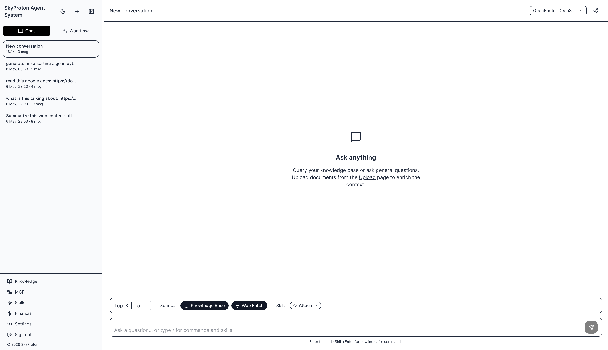
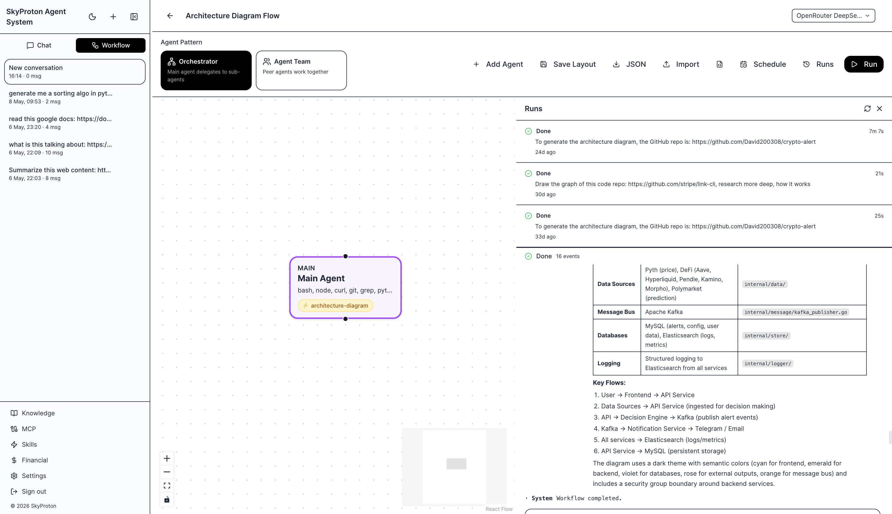
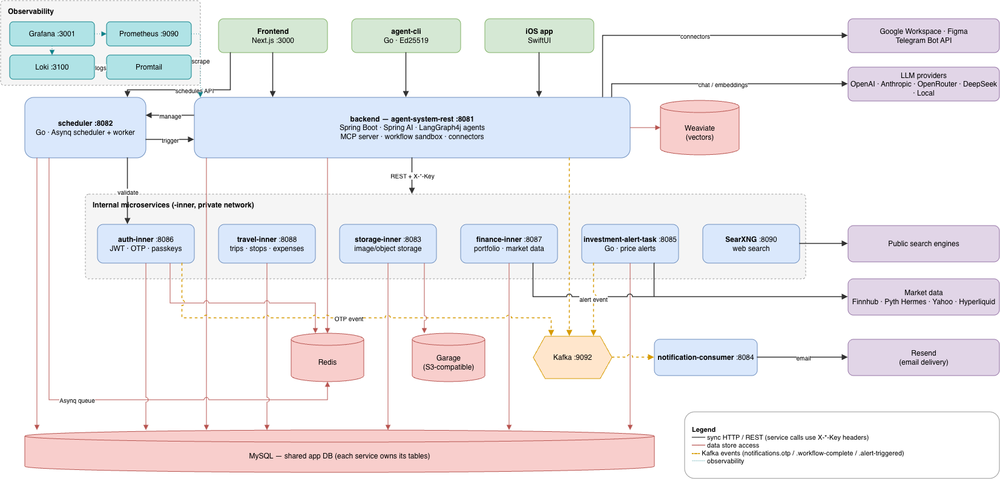

# SkyProton Agent System

| Chat Mode                  | Workflow Mode                      |
| -------------------------- | ---------------------------------- |
|  |  |

## Tech Stack

| Area          | Technology                                                                                                 |
| ------------- | ---------------------------------------------------------------------------------------------------------- |
| Frontend      | Next.js 16 (App Router) · React 19 · TypeScript 6 · Zustand 5 · Tailwind CSS 4 · Google Maps         |
| iOS app       | SwiftUI · MapKit                                                                                          |
| Backend       | Java 21 (virtual threads) · Spring Boot 3.4.5 · Spring Data JPA · Resilience4j 2.2 · SpringDoc OpenAPI |
| AI            | Spring AI 1.1 · LangGraph4j 1.7 · MCP server (SSE) · Apache Tika · Jsoup                               |
| LLM providers | OpenAI · Anthropic · OpenRouter · DeepSeek · local (Ollama)                                            |
| Go services   | Go 1.25 · Asynq (Redis-backed task queue)                                                                 |
| Agent CLI     | Go 1.22 · Cobra                                                                                           |
| Auth          | JJWT · WebAuthn (passkeys) · OTP email via Resend · Ed25519 CLI keys                                    |
| Data          | MySQL 8 · Weaviate (vectors) · Redis 7 (Lettuce, Redisson, Bucket4j) · Garage (S3-compatible storage)   |
| Messaging     | Apache Kafka (KRaft, single node)                                                                          |
| Web search    | SearXNG (self-hosted)                                                                                      |
| Observability | Prometheus · Grafana · Loki · Promtail                                                                  |
| Deployment    | Docker Compose · GitHub Actions (CLI cross-compile releases)                                              |

---

## System Architecture



---

## Connectors (MCP)

External services are connected via OAuth (Google, Figma) or the Telegram Login Widget. Connector tokens are **org-scoped**: connecting Google in personal mode and in team mode produces two separate, isolated tokens.

| Connector       | Provider key | Features                                         |
| --------------- | ------------ | ------------------------------------------------ |
| Google Docs     | `google`   | Read documents, write new docs                   |
| Google Sheets   | `google`   | Read spreadsheets, write new sheets              |
| Google Slides   | `google`   | Read presentations, write new slides             |
| Google Calendar | `google`   | List upcoming events, create new events          |
| Figma           | `figma`    | OAuth token for Figma file access                |
| Telegram        | `telegram` | Send messages to the user's linked Telegram chat |

---

## Workflow Engine

Workflows compose multiple AI agents into pipelines with three patterns:

| Pattern          | Description                                                                       |
| ---------------- | --------------------------------------------------------------------------------- |
| `ORCHESTRATOR` | One orchestrator agent routes tasks to specialist agents                          |
| `TEAM`         | Multiple agents run in`PARALLEL` or `SEQUENTIAL` order                        |
| `GRAPH`        | Explicit node graph — agents, conditions, and an end node wired together by hand |

Each workflow run executes inside an ephemeral Docker sandbox (`SandboxService`) with CPU/memory resource limits and a watchdog that terminates runaway containers. Agents can load user-uploaded **Skills** (code files) to extend their capabilities.

---

## Scheduler

The Go microservice (`:8082`) uses **Asynq** (Redis-backed) for durable cron scheduling, with schedule state persisted in MySQL.

### How it works

```
Frontend / Workflow Agent
        │
        │  REST (JWT or service-key)
        ▼
Go Scheduler (:8082)
  ├── REST API  →  cronmgr (asynq.Scheduler)  →  Redis
  └── Asynq Worker (same process)
           └── rag:trigger handler
                 └── POST Spring Boot /api/v1/scheduler/trigger
                           (MaxRetry=3, Timeout=5 min)
```

---

## Internal Microservices

| Service           | Port      | Backs                                                                            | Auth header       |
| ----------------- | --------- | -------------------------------------------------------------------------------- | ----------------- |
| `storage-inner` | `:8083` | Garage (S3-compatible) object storage                                            | `X-Storage-Key` |
| `auth-inner`    | `:8086` | JWT mint/validate, OTP, WebAuthn passkeys, CLI Ed25519 key auth                  | `X-Auth-Key`    |
| `finance-inner` | `:8087` | Financial portfolio (cash/stocks/crypto/futures/cards/salary) + live market data | `X-Finance-Key` |
| `travel-inner`  | `:8088` | Trips, stops, expenses, chat-visibility opt-in                                   | `X-Travel-Key`  |

---

## Agent CLI

A standalone Go binary that wraps the backend REST API for terminal use. Config is stored in `~/.agent-cli/config.json`. On first login an Ed25519 key pair is generated and the public key is registered with the server.

### Install

**macOS (Apple Silicon)**

```bash
curl -L https://github.com/David200308/rag-agent-system/releases/latest/download/agent-cli_darwin_arm64 \
  -o agent-cli && chmod +x agent-cli && sudo mv agent-cli /usr/local/bin/
```

**macOS (Intel)**

```bash
curl -L https://github.com/David200308/rag-agent-system/releases/latest/download/agent-cli_darwin_amd64 \
  -o agent-cli && chmod +x agent-cli && sudo mv agent-cli /usr/local/bin/
```

**Linux (amd64)**

```bash
curl -L https://github.com/David200308/rag-agent-system/releases/latest/download/agent-cli_linux_amd64 \
  -o agent-cli && chmod +x agent-cli && sudo mv agent-cli /usr/local/bin/
```

**Windows** — download `agent-cli_windows_amd64.exe` from the [Releases](https://github.com/David200308/rag-agent-system/releases) page.

### First-time setup

```bash
agent-cli auth config --url https://api.agent.skyproton.com
agent-cli auth login
```

### Commands

| Command                           | Subcommands                                             | Description                                                  |
| --------------------------------- | ------------------------------------------------------- | ------------------------------------------------------------ |
| `auth`                          | `login` `logout` `status` `config`              | Authenticate via email OTP; manage server URL                |
| `chat`                          | *(interactive REPL)* `ask <question>`               | Chat with the RAG agent;`-c <id>` continues a conversation |
| `conversation` (alias `conv`) | `list` `get` `delete` `archive` `unarchive`   | Manage conversations                                         |
| `workflow` (alias `wf`)       | `list` `get` `delete` `runs` `logs`           | View workflows, run history, and agent logs                  |
| `financial` (alias `fin`)     | `deposits` `stocks` `crypto` `cards` `prices` | Manage financial portfolio entries                           |

#### Examples

```bash
# Interactive chat session
agent-cli chat

# Single-shot query, continuing an existing conversation
agent-cli chat ask "Summarise the last earnings call" -c <conversation-id>

# List recent conversations
agent-cli conversation list

# View logs for a workflow run
agent-cli workflow logs <run-id>

# Add a stock position
agent-cli financial stocks add --data '{"symbol":"AAPL","stockAmount":10,"investAmount":1500,"currency":"USD"}'

# Force-refresh live market prices
agent-cli financial prices refresh
```
